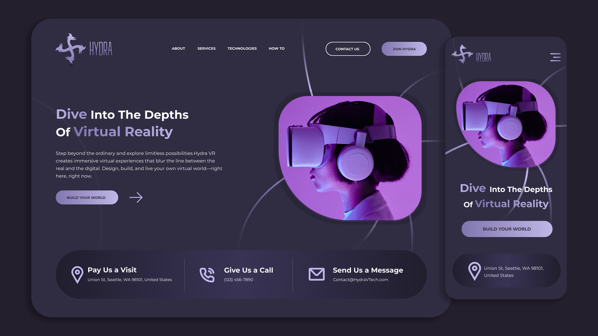

# HYDRA — VR Landing Page

HYDRA is a responsive and modern landing page designed for a VR (Virtual Reality) product or service.  
Built with clean HTML, CSS, and a bit of JavaScript, it's a stylish frontend project suitable for showcasing futuristic tech.

## 🚀 Demo

Watch the full tutorial on YouTube:  
📺 [Create HYDRA - VR Landing Page with HTML, CSS & JavaScript]()

## 🛠 Tech Stack

- HTML5
- CSS3
- JavaScript (vanilla)
- Responsive design (Flexbox)

## 📸 Screenshots

## 📁 Folder Structure

HYDRA/
├── index.html
├── css/
│ └── style.css
├── js/
│ └── script.js
├── assets/
│ ├── images/
│ └── icons/

markdown
Copy
Edit

## 🧠 What You'll Learn

- Creating a modern layout using Flexbox
- Styling a futuristic-themed landing page
- Making components responsive
- Organizing assets and writing clean frontend code

## 📌 Author

**Codinom**  
🔗 [GitHub](https://github.com/Codinom) | 📹 [YouTube](https://www.youtube.com/@Codinom)

---

> 💡 Don't forget to ⭐ star this repo if you found it useful!
