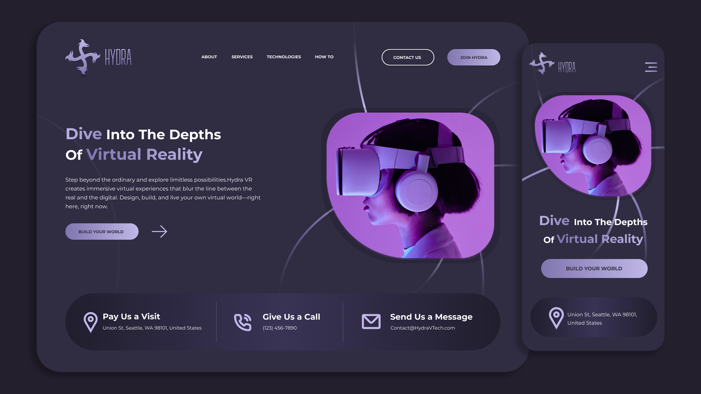

## 🚀 Demo
https://hydra-vr-five.vercel.app/

# 🌐 Hydra VR – Immersive Virtual Worlds Powered by AI

Hydra VR is an immersive, AI-enhanced virtual reality platform where users can design, build, and explore custom-made digital environments. Whether for education, simulation, relaxation, or adventure, Hydra VR is where your imagination meets innovation.

---

## 🚀 Features

- 🌍 Build custom virtual environments in minutes
- 🧠 Real-time AI NPCs using OpenAI’s GPT API
- 📚 Personalized educational narration and experiences
- 🧘‍♀️ Self-care VR spaces with generative meditation
- 🏞️ Text-to-scene: Describe a place, and we create it

---

## 🤖 Technologies Used

| Category            | Stack                                   |
|---------------------|-----------------------------------------|
| VR Engine           | Unity / Unreal Engine                   |
| AI / NLP            | OpenAI API (GPT-4)                      |
| Web Technologies    | WebXR, Three.js, JavaScript             |
| Backend Integration | Node.js, Express (optional)             |
| Devices             | Meta Quest, HTC Vive, Web Browsers      |

---

## 📦 Installation

```bash
git clone https://github.com/your-username/hydra-vr.git
cd hydra-vr

## 🛠 Tech Stack

- HTML5
- CSS3
- JavaScript (vanilla)
- Responsive design (Flexbox)

## 📸 Screenshots



## 📁 Folder Structure

HYDRA/
├── index.html
├── css/
│ └── style.css
├── js/
│ └── script.js
├── assets/
│ ├── images/
│ └── icons/

markdown
Copy
Edit


**Linx**  
🔗 [GitHub](https://github.com/Gospellinx) |
---

> 💡 Don't forget to ⭐ star this repo if you found it useful!
